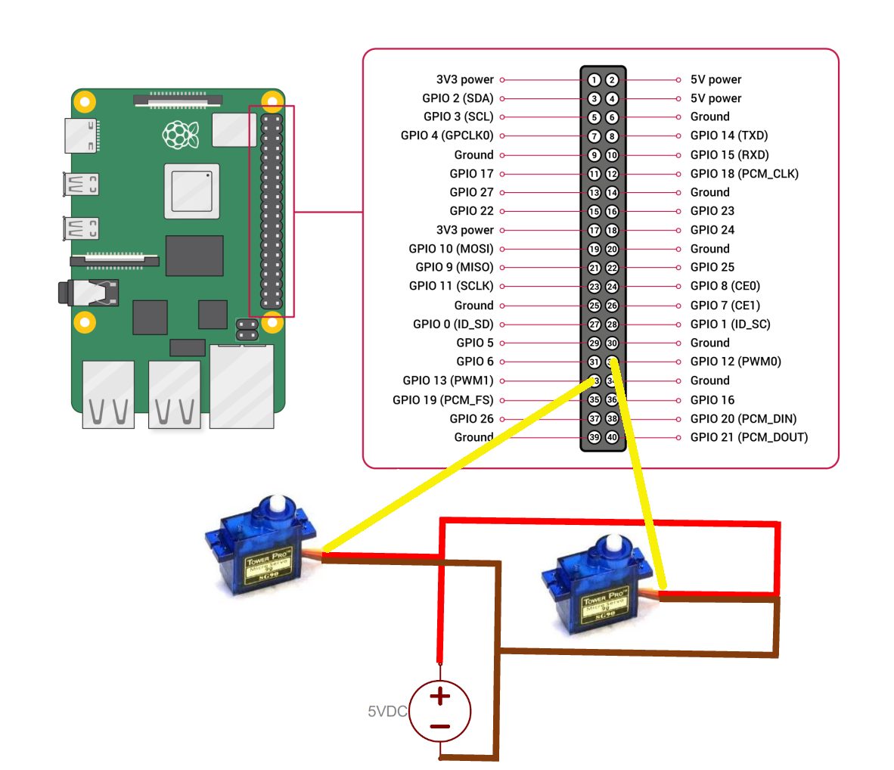
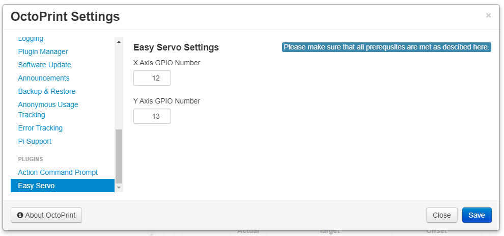

# Easy Servo

Here is a simple plugin to control two servos using the OctoPrint Control tab. It has been programmed in conjuction with a camera gimbal mount design I published on Thingiverse [here](https://www.thingiverse.com/thing:4381240).

It utilizes a custom `@EASYSERVO <GPIO NUMBER> <RELATIVE ANGLE DIFFERENCE>` command that can be incorporated within your slicer to automatically move while printing. 

Example: `@EASYSERVO 12 10` will move the servo attached to GPIO number 12 10 degrees in the positive direction from the current position. `@EASYSERVO 13 -10` will move the servo attached to GPIO number 13 10 degrees in the negative direction from the current position. 

**Note:** The servos will initialize at 90 degrees on OctoPrint start up and is limited to a 90 degree rotation in either direction.


## Pre-Installation Requirements

Please follow the steps below in order for this plugin to properly operate. Without these steps the plugin will not be able to control the assigned GPIO numbers on your Pi and as a result the servos will not move.

1. SSH to the pi and run the following command.

```
sudo raspi-config
```

Select **Interface Options**


Select **I2C**


Select **Yes** to enable the ARM I2C interface


Press **Ok**


Select **Finish** to exit raspi-config.


2. Now run the following commands to install and configure the required pigpio daemon.

```
sudo apt-get install pigpiod
sudo nano /lib/systemd/system/pigpiod.service
```

This will open a text editor. Change the ExecStart line to be `/usr/bin/pigpiod -x -1` like the screenshot below in order to enable write access to all GPIO pins. You can adjust this command to fit your specific needs or to limit write capabilities to only the GPIO pins you are using. The plugin uses the default GPIO pins 12 for the X Axis and 13 for the Y axis. Check the [pigpiod](http://abyz.me.uk/rpi/pigpio/pigpiod.html) site for possible comand-line options and the [Raspberry Pi Foundation](https://www.raspberrypi.org/documentation/usage/gpio/) site for additional GPIO information.

**Note:** the last character at the end of the example line above is the number one.


Press CTRL+X to exit, Press Y to save, Press enter to keep the original name.

3. Now run the following commands.

```
sudo systemctl enable pigpiod
sudo service pigpiod start
sudo shutdown
```

Your pi will shutdown and you are now ready to connect your servos. 

**Warning:** Make sure you Pi has enough time to cleanly shutdown and then unplug the power supply before continuing.

Connect the 5V and GND wires of your servos (recommended exernal power source) followed by the signal wires to the two GPIO numbers that you want to control with the plugin. The below diagram schows the servos connected to GPIO numbers 12 and 13 (the default plugin's GPIO number assignments) on a Pi 3B+.



Use the chart below to identify the GPIO numbers to use in the plugin's settings after install if you choose anything other than 12 or 13 as diagrammed above. The GPIO numbers in yellow are the ones that can be controlled by this plugin.

*Grounding the external power supply may be a solution if your servos are doing anything strange!*


**You are now ready to continue with the plugin install/configuration.**

## Install

Install via the bundled [Plugin Manager](https://docs.octoprint.org/en/master/bundledplugins/pluginmanager.html)
or manually using this URL:

    https://github.com/iFrostizz/OctoPrint-EasyServo/archive/master.zip

## Settings

The plugin supports the ability to configure the GPIO numbers used for controlling the servos for the X and Y axes.



### Disclaimer

Although I have used this plugin and it has worked for me without issues, I take no resposiblity for any damage caused by using this plugin or connecting servos to your Pi. Please make sure to do your reseach and understand the dangers and please be careful.

